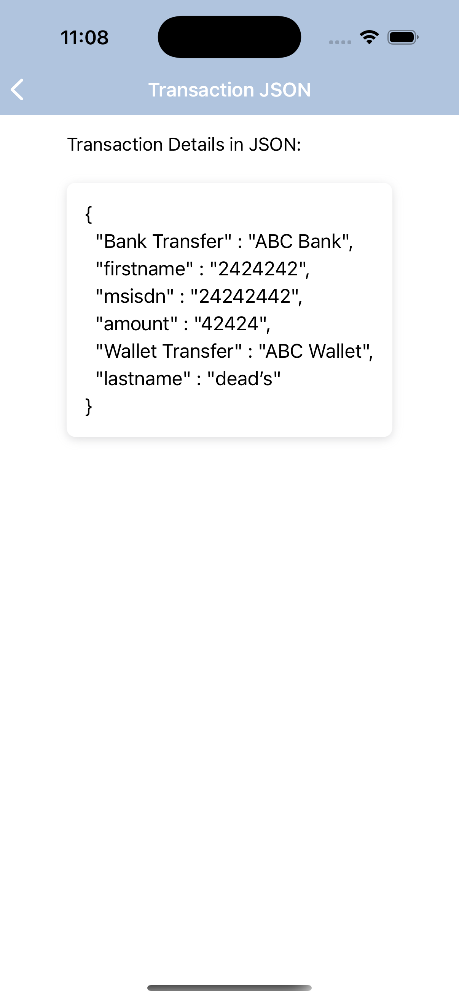
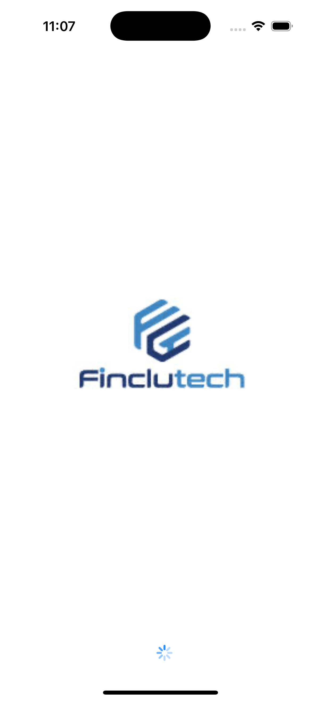
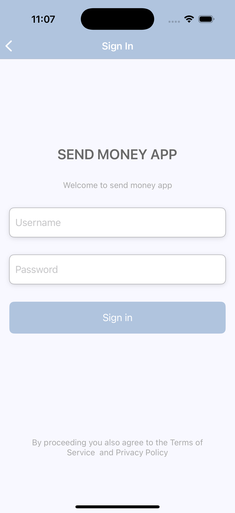
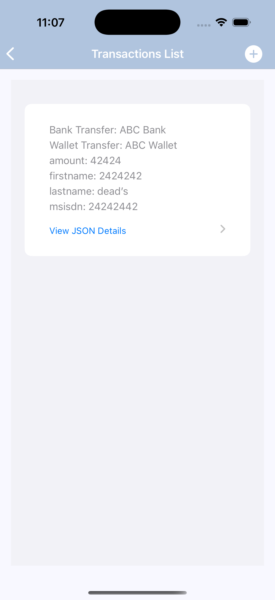
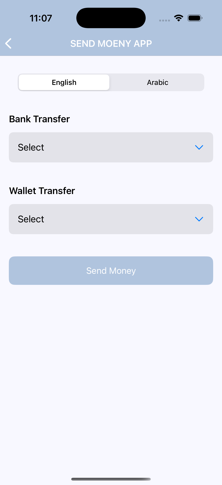
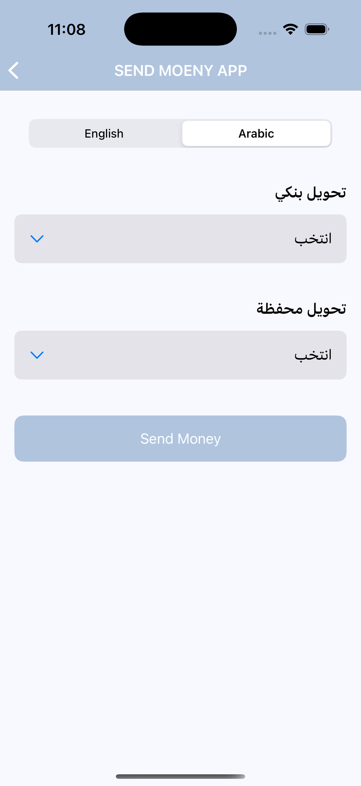
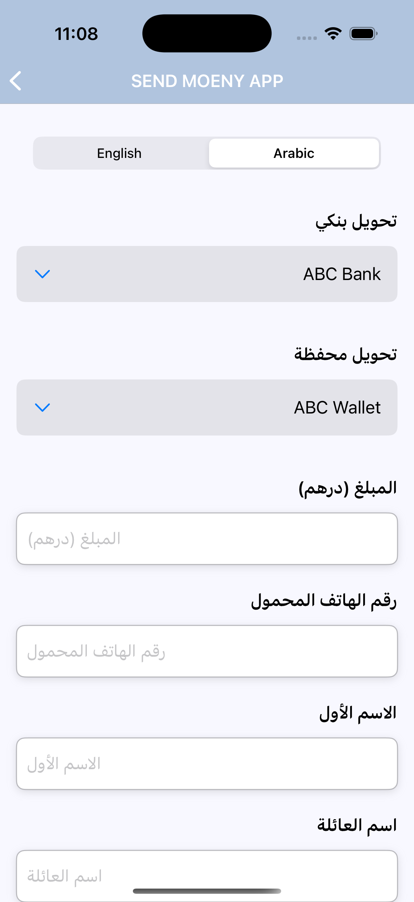

# Send Money App

## ScreenShots








## Introduction
The Send Money App allows users to transfer money using different providers with a dynamic form interface. The app supports multiple languages (English and Arabic) and provides users with the ability to select a provider and fill in the required details.

## Features
- Dynamic form fields based on selected providers.
- Multi-language support (English and Arabic).
- Validation of form inputs.
- View the list of previous transactions.
- Submit transactions and view details in JSON format.

## Architecture
The app follows a modular and reactive architecture using SwiftUI and ReSwift. The app's state is managed by ReSwift, and the UI is built using SwiftUI components.

### Key Components
- **SendMoneyView**: The main view where users can input transaction details and submit the form.
- **MainScreenView**: Displays a list of transactions and allows users to view transaction details in JSON format.
- **ReSwift Store**: Manages the state of the application, including form data and transaction history.
- **ViewStore**: A wrapper around the ReSwift store that provides an interface for the views to interact with the app's state.

## Setup Instructions

### Prerequisites
- Xcode 12.0 or higher
- Swift 5.0 or higher

### Steps to Build and Run the App

1. Clone the repository:
    ```bash
    git clone <repository-url>
    ```

2. Open the project in Xcode:
    ```bash
    open SendMoneyApp.xcodeproj
    ```

3. Build and run the app:
    - Select a simulator or a connected device.
    - Click the "Run" button in Xcode to build and launch the app.

4. The app should open on the simulator or device, and you can interact with the UI to submit transactions and view transaction details.

## Design Choices
- **SwiftUI**: Used for the user interface to take advantage of its declarative syntax and performance benefits.
- **ReSwift**: Chosen for state management to handle complex state updates in a predictable manner across the app.
- **Multi-language Support**: English and Arabic were selected as the supported languages to cater to a wider user base.
- **Dynamic Forms**: The app dynamically loads form fields based on the selected provider, offering flexibility for different types of transactions.

## Conclusion
This app offers a simple and flexible solution for sending money with customizable forms for different providers. By using modern iOS technologies like SwiftUI and ReSwift, it provides an efficient, maintainable, and scalable solution.

## License
This project is licensed under the MIT License - see the [LICENSE](LICENSE) file for details.
